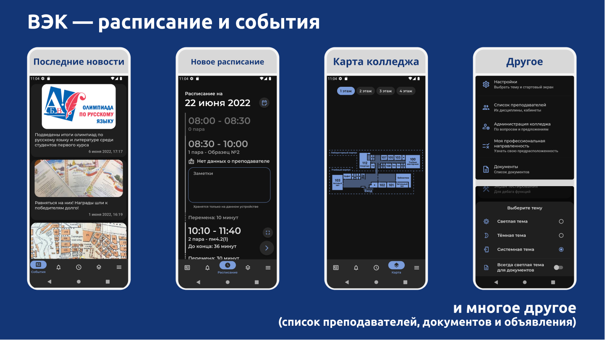
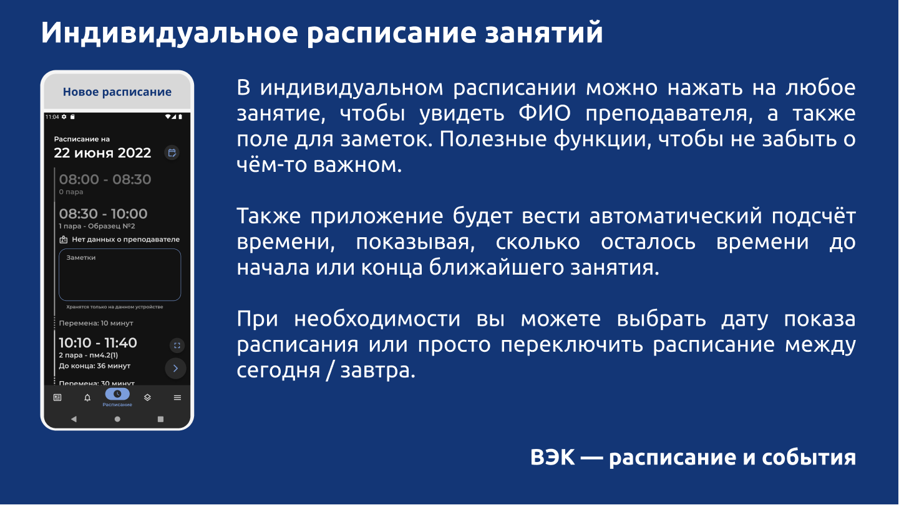
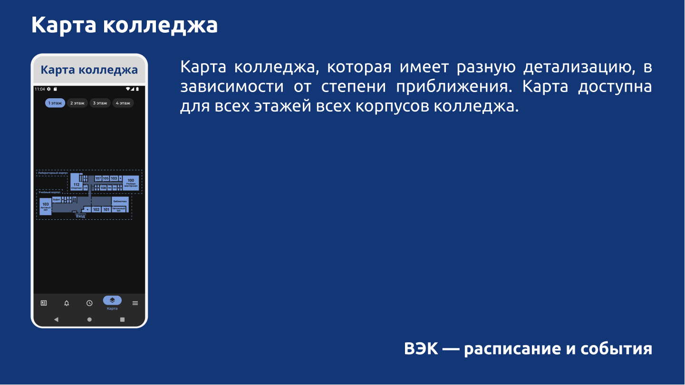

# ВЭК

Приложение для студентов и сотрудников [Волгоградского энергетического колледжа](https://energocollege.ru/).

## Скачать
* [Google Play](https://play.google.com/store/apps/details?id=tem.apps.vpec)
* [GitHub](https://github.com/ShyroTeam/vpec/releases/latest)
* [Telegram](https://t.me/ShyroTeam)

## Особенности
* Быстрый и удобный доступ к всегда актуальному расписанию занятий и звонков
* Формирование личного расписания студента и преподавателей
* Различная полезная информация (список преподавателей, карта кабинетов и прочее)
* Объявления от администрации колледжа
* Светлая и тёмная тема
* События колледжа

## Скриншоты

### 

### 

## Дизайн приложения
Дизайн приложения подготовлен [@Lazurit11](https://github.com/lazurit11).

Просмотреть макеты можно [здесь](https://www.figma.com/file/KrxdlfVlI88BKw8JRtZvf8/VPEC-UI?node-id=666%3A362).

## License
    Copyright 2021 ShyroTeam

    Licensed under the Apache License, Version 2.0 (the "License");
    you may not use this file except in compliance with the License.
    You may obtain a copy of the License at

    http://www.apache.org/licenses/LICENSE-2.0

    Unless required by applicable law or agreed to in writing, software
    distributed under the License is distributed on an "AS IS" BASIS,
    WITHOUT WARRANTIES OR CONDITIONS OF ANY KIND, either express or implied.
    See the License for the specific language governing permissions and
    limitations under the License.